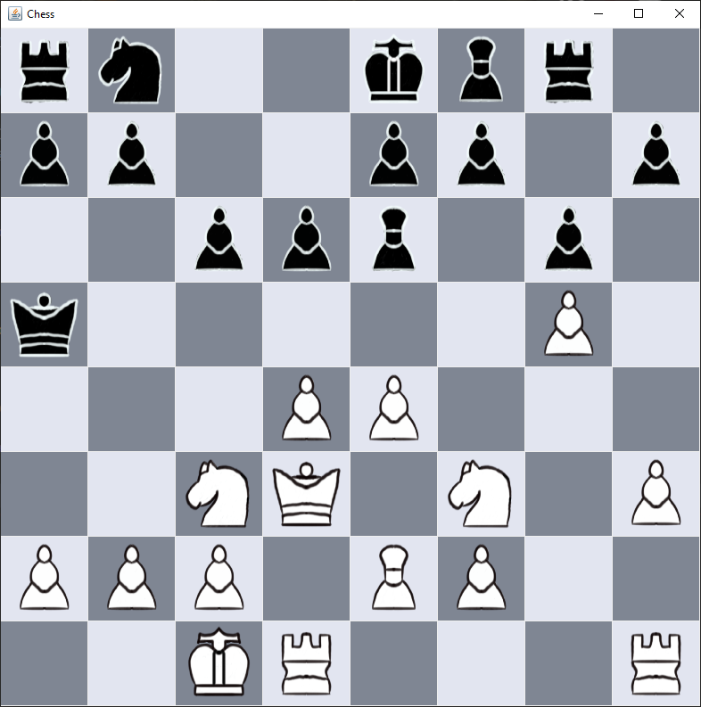
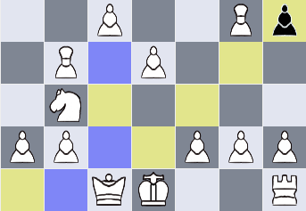

 
Pieces drawn in SketchBook

# Chess

------------------

Work in progress chess engine developed in Java. Main focus is the engine itself, so the user interface has a low priority at the moment. The board tiles are stored in a one dimensional array, the pieces are stored in a list (each color has their own), so it is not needed to iterate over the whole board for the move generation.

In the first version I copied the board and piece objects for each generated move, which turned out to be rather slow. In this version there is a method to create a move and a method to take back a move, so the same board and piece list can be used.

Since the engine at the moment doesn't use an opening book, the opening moves of the engine can be confusing at the current state.

Possible moves are highlighted when a chess piece is selected (hold mouse button). 

 
 

## Todo

------------------

Currently implementing special moves/rules, after that it is time to refactor the code.
- [x] en passant
- [x] castling
- [x] pawn promotion (currently directly promotes to queen)
- [x] 50-move/75-move rule (not activated yet)
- [x] three-fold repetition (not activated yet)
- [x] only allow player to make moves that don't lead to own king being in check
- [ ] end game detection and user feedback (will implement it after code cleanup)
 
 

find and fix bugs 
- [ ] short castling sometimes not possible, even if it should, will look at this after first code cleanup
 
 

refactor code 
- [x] extract move generation logic from board class
- [ ] extract lookup table generation from piece classes, so a lookup table is generated only one time for each piece and not every time a piece is created
 
 

improve evaluation of chess positions and quality of produced moves
- [ ] include opening book
- [ ] differentiate between opening, middle and end game
- [x] lookup table for each chess piece that gives extra points for good positions (currently only pieces themself have a value, the position is not considered)
 
 
 
improve speed
- [ ] implement <a href="https://en.wikipedia.org/wiki/Alpha%E2%80%93beta_pruning">alpha beta pruning</a>
- [ ] implement <a href="https://www.chessprogramming.org/Quiescence_Search">quiescence search</a>
- [ ] store already evaluated positions of a game in a hash table to be able to quickly look them up
- [ ] every time a pawn gets promoted, a new queen object is created. This slows down the move generation. Maybe check for already created and deactivated queen object in piece list?

user interface (low priority, since main interest is developing the chess engine) 
- [x] add error message when images could not be found
- [x] run engine and interface on different threads
 
 
### You need at least Java SE 15 to run the jar

------------------

You can get the newest version here: https://www.oracle.com/java/technologies/downloads/